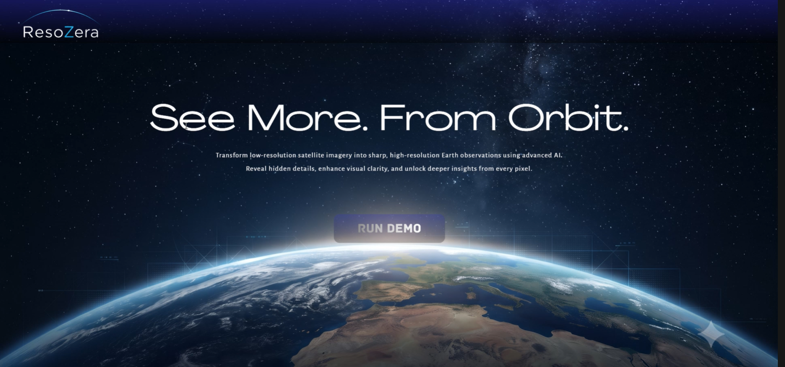
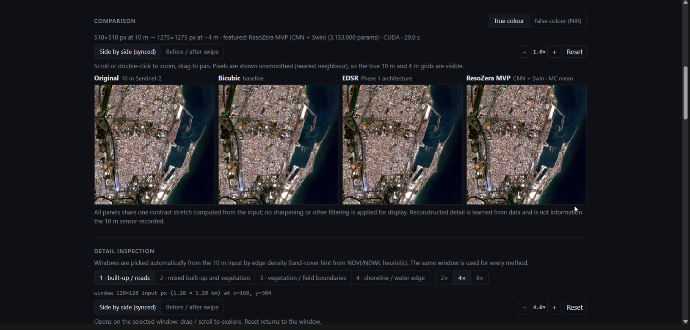

# ResoZera

### AI-Powered Super-Resolution Mapping for Sentinel-2 Satellite Imagery

**SIH 2026 — Problem Statement SIH26142**  
**Deep Learning Based Super Resolution Mapping (SRM) from Medium Resolution Satellite Imageries**

ResoZera is a geospatial AI prototype that transforms medium-resolution **Sentinel-2 L2A imagery** into an AI-enhanced fine-scale product while focusing on **spatial structure, spectral consistency, quantitative validation, uncertainty estimation, and GIS usability**.

> **Core pipeline:**  
> `Sentinel-2 → Preprocessing → Super-Resolution → Validation → Uncertainty → GIS`

---

## ✨ Key Features

- **4-band Sentinel-2 processing:** B02, B03, B04 and B08
- **Cloud/SCL masking** and consistent normalization
- **64×64 patch-based processing**
- **Phase 1:** Lightweight EDSR baseline
- **Main MVP:** Lightweight CNN + Swin-style window attention
- **~2.5× upsampling** from a 10 m input grid toward a ~4 m target grid
- **Spectral-aware reconstruction** using reconstruction, spectral and gradient losses
- **MC Dropout uncertainty estimation**
- **Bicubic vs EDSR vs ResoZera MVP benchmarking**
- **PSNR, SSIM, SAM and ERGAS evaluation**
- **Georeferenced GeoTIFF output**
- **Interactive GIS visualization**
- **Prepared demo scenes for rapid prototyping**

---

## 🛰️ Problem Statement

Medium-resolution satellite imagery is valuable for large-scale Earth observation, but its spatial resolution can limit fine-scale analysis.

SIH26142 asks for a robust super-resolution framework that can transform:

**10 m Sentinel-2 imagery → sharper information-rich products at <4 m**

while preserving:

- geospatial consistency
- spectral consistency
- interpretability
- analytical utility
- uncertainty/error awareness

Potential applications include **crop monitoring, urban analysis and disaster assessment**.

---

## 💡 ResoZera Solution

ResoZera uses a two-stage model strategy.

### Phase 1 — Lightweight EDSR Baseline

```text
Sentinel-2 L2A
B02 + B03 + B04 + B08
        ↓
Cloud/SCL masking
        ↓
Normalization
        ↓
64×64 patches
        ↓
3×3 Conv
        ↓
6 Residual Blocks
        ↓
Reconstruction Conv
        ↓
~2.5× Upsampling
        ↓
~4 m target-grid product
```

### Main MVP — Lightweight CNN + Swin-style Attention

```text
Sentinel-2 L2A
B02 / B03 / B04 / B08
        ↓
Cloud / SCL masking
        ↓
Normalization
        ↓
64×64 patches
        ↓
3×3 CNN Feature Extractor
        ↓
4 Residual CNN Blocks
        ↓
2–4 Lightweight Swin-style
Window-Attention Blocks
        ↓
Feature Fusion
        ↓
Spectral-aware Reconstruction
        ↓
~2.5× Upsampling
        ↓
~4 m target-grid, 4-channel output
        ↓
MC Dropout Uncertainty
```

---

## 🧠 Main MVP Architecture

| Component | Specification |
|---|---|
| Input | Sentinel-2 L2A |
| Bands | B02, B03, B04, B08 |
| Input channels | 4 |
| Feature channels | 64 |
| CNN residual blocks | 4 |
| Swin-style attention blocks | 2–4 |
| Target model size | ~3–5M parameters |
| Upsampling | ~2.5× |
| Output | 4-channel fine-scale product |
| Reconstruction loss | L1 |
| Spectral loss | SAM / spectral consistency |
| Spatial loss | Gradient loss |
| Uncertainty | MC Dropout |
| Metrics | PSNR, SSIM, SAM, ERGAS |

---

## 🔬 Training Pipeline

ResoZera is designed around paired low-resolution/high-resolution samples.

```text
High-Resolution Reference
          ↓
Controlled degradation / preparation
          ↓
10 m LR training image
          ↓
      SR Model
          ↓
   Super-Resolved output
          ↓
  Compare against HR target
```

The training pipeline supports:

- paired LR-HR datasets
- patch extraction
- train/validation split
- configurable epochs
- checkpointing and resume
- CUDA training
- mixed precision
- configurable loss weights

### Expected dataset structure

```text
dataset/
├── train/
│   ├── lr/
│   └── hr/
└── val/
    ├── lr/
    └── hr/
```

---

## 📊 Evaluation

ResoZera compares three reconstruction approaches:

1. **Bicubic** — non-learning baseline
2. **EDSR** — Phase 1 CNN baseline
3. **ResoZera MVP** — CNN + Swin-style attention

Metrics:

| Metric | Purpose |
|---|---|
| **PSNR** | Pixel-level reconstruction fidelity |
| **SSIM** | Structural similarity |
| **SAM** | Spectral consistency |
| **ERGAS** | Relative global reconstruction error |

> Metrics must come from actual evaluated outputs and reference data. ResoZera does not fabricate performance figures.

---

## 🎯 Uncertainty Estimation

The MVP uses **Monte Carlo Dropout** during inference.

```text
Input
  ↓
Model
 ├─ stochastic pass 1
 ├─ stochastic pass 2
 ├─ ...
 └─ stochastic pass N
          ↓
Mean prediction
+
Prediction variance
          ↓
Uncertainty map
```

The uncertainty map highlights regions where reconstruction is less reliable.

Typical difficult areas can include:

- dense buildings
- road edges
- field boundaries
- complex spatial textures

Uncertainty is **not presented as accuracy** and is not treated as a guaranteed probability of correctness.

---

## 🗺️ Geospatial Output

ResoZera is designed to retain geospatial usability rather than producing only a visualization image.

Where source metadata permits, the system can generate:

- **GeoTIFF**
- preserved CRS
- preserved geotransform
- geospatial footprint
- four output bands

The enhanced product can be visualized in the integrated map interface.

---

## 🖼️ Screenshots

### Landing Page

The existing ResoZera landing page is preserved, with the **RUN DEMO** entry point leading into the prototype.



### Super-Resolution Comparison

The demo compares the original Sentinel-2 image with Bicubic, Phase 1 EDSR and the ResoZera MVP output.



> The screenshot is a visualization of the prototype comparison interface. Super-resolution output should be interpreted as AI reconstruction, not as guaranteed recovery of information that the 10 m sensor did not directly capture.

---

## 🧪 Current Prototype Results

The current prototype evaluation reported the following proxy-validation results:

| Method | PSNR ↑ | SSIM ↑ | SAM ↓ | ERGAS ↓ |
|---|---:|---:|---:|---:|
| Bicubic | 37.196 | 0.8921 | 2.462 | 4.490 |
| EDSR (Phase 1) | 38.428 | 0.9205 | 2.136 | 3.870 |
| **ResoZera MVP** | **38.519** | **0.9223** | **2.115** | **3.830** |

### Validation note

The reported metrics come from the **25 m → 10 m proxy experiment**. They should **not** be presented as direct quantitative proof of true 10 m → <4 m accuracy.

True 10 m → <4 m quantitative validation requires suitable co-registered high-resolution reference imagery.

---

## 🧩 Innovation / Uniqueness

ResoZera does not claim to invent satellite super-resolution itself. Its differentiation is the integrated workflow:

- **Hybrid lightweight model:** CNN residual learning + Swin-style window attention
- **Spectral-spatial constraints:** reconstruction + spectral + gradient objectives
- **Uncertainty-aware reconstruction:** MC Dropout uncertainty map
- **Geospatial product workflow:** georeferenced output + GIS visualization
- **Benchmark progression:** Bicubic → EDSR → ResoZera MVP

### Core idea

> **Sharper imagery should also be measurable, geospatially usable, and accompanied by an indication of where the reconstruction is less reliable.**

---

## 🛠️ Tech Stack

### AI / Machine Learning
- Python
- PyTorch
- NumPy
- scikit-image

### Remote Sensing / Geospatial
- Sentinel-2 L2A
- Rasterio
- GeoTIFF
- SCL / Cloud Masking
- Leaflet / OpenStreetMap

### Application
- React
- JavaScript
- FastAPI
- Uvicorn
- REST API
- YAML configuration
- PyTest

---

## 🚀 Project Structure

```text
ResoZera/
├── resozera/
│   ├── models/
│   │   ├── swin_mvp.py
│   │   └── ...
│   ├── train.py
│   ├── evaluate.py
│   ├── inference.py
│   ├── infer.py
│   ├── config.py
│   └── viz.py
├── backend/
│   └── main.py
├── frontend/
│   └── src/
│       ├── pages/
│       ├── components/
│       └── ...
├── configs/
│   └── phase2_swin_mvp.yaml
├── checkpoints/
│   ├── edsr_phase1/
│   └── swin_mvp_phase2/
├── data/
│   └── demo/
├── outputs/
├── tests/
└── README.md
```

---

## ▶️ Running the Project

### Backend

```bash
uvicorn backend.main:app --host 127.0.0.1 --port 8000
```

### Frontend

```bash
cd frontend
npm run dev
```

For a production frontend build:

```bash
npm run build
```

### Train Phase 2

```bash
python -m resozera.train --config configs/phase2_swin_mvp.yaml
```

### Evaluate

```bash
python -m resozera.evaluate --split val
```

### Run MVP inference

```bash
python -m resozera.infer \
  --input data/demo/punjab_agri \
  --out outputs/cli/punjab
```

### Run Phase 1 EDSR

```bash
python -m resozera.infer \
  --input data/demo/punjab_agri \
  --out outputs/cli/p1 \
  --model edsr
```

### Run tests

```bash
python -m pytest -q tests
```

---

## ⚠️ Limitations

- Super-resolution is an **AI reconstruction**, not direct recovery of information physically absent from the original sensor.
- Proxy 25 m → 10 m validation does not establish true 10 m → <4 m accuracy.
- High-quality quantitative validation requires appropriate co-registered high-resolution reference imagery.
- Uncertainty indicates areas of increased prediction variability; it does not directly equal reconstruction error magnitude.
- Real-world performance depends on the quality, registration and representativeness of the paired training data.

---

## 🔮 Future Development

Possible extensions include:

- stronger real-world degradation modeling
- broader high-resolution reference datasets
- more robust 10 m → <4 m validation
- downstream crop/building/disaster analysis
- improved uncertainty calibration
- optimized inference for larger scenes

---

## 👥 Project

**ResoZera**  
SIH 2026 — SIH26142  
Deep Learning Based Super Resolution Mapping from Medium Resolution Satellite Imageries

